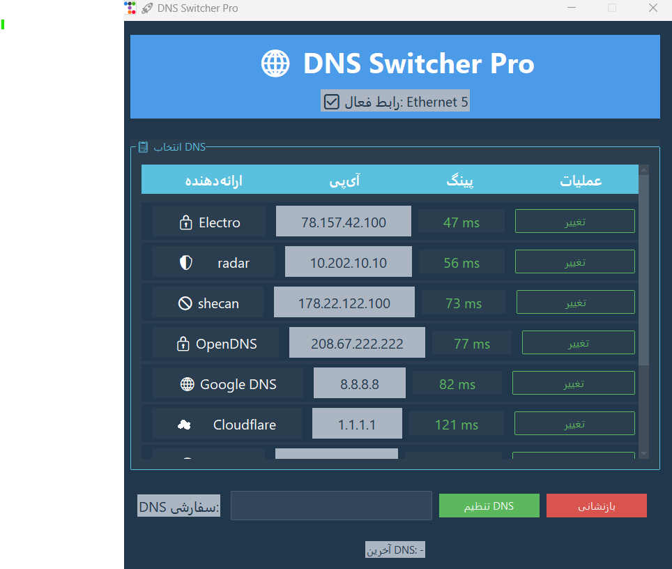

## 🌐 DNS Switcher Pro
**DNS Switcher Pro** یک ابزار ساده، کاربردی و **اوپن‌سورس** برای تغییر سرورهای DNS در ویندوز است.

                                                                                                                                                          
شما می‌توانید **مستقیم فایل اجرایی (exe)** این برنامه را دانلود و بدون نیاز به نصب، استفاده کنید.

> ✅ [دانلود نسخه اجرایی](#) :https://file.kiwi/6eb479ed#wuINOcaRuGBAxt0ncFAAIQ


---


### چرا DNS Switcher Pro را ساختیم؟

بیشتر ابزارهای تغییر DNS که در اینترنت وجود دارند، با مشکلات زیر مواجه‌اند:

* ❌ **عدم اوپن‌سورس بودن:** کاربران نمی‌دانند این برنامه‌ها چه کاری انجام می‌دهند، که این می‌تواند امنیت آن‌ها را به خطر بیندازد.
* ⚠️ **مشکوک به بدافزار بودن:** بسیاری از این ابزارها توسط منابع نامعتبر منتشر می‌شوند و احتمال وجود کدهای مخرب در آن‌ها وجود دارد.
* 🧩 **نبود ابزار رسمی:** شرکت‌هایی مثل Google یا Cloudflare معمولاً ابزار رسمی GUI برای تنظیم DNS روی ویندوز ارائه نمی‌دهند.

  



---

### ✅ ویژگی‌های کلیدی

* 🔃 **تغییر سریع DNS با یک کلیک:** لیستی از سرورهای محبوب مانند Google DNS، Cloudflare، Quad9 و … با پینگ پایین در دسترس شماست.
* ✍️ **افزودن DNS سفارشی:** امکان وارد کردن IPهای دلخواه برای تنظیم DNS.
* ♻️ **بازگشت به حالت پیش‌فرض (DHCP):** با یک کلیک تنظیمات شبکه به حالت خودکار بازمی‌گردند.
* 🖥️ **نمایش رابط شبکه فعال:** شما همیشه می‌دانید در حال تنظیم کدام رابط شبکه هستید.
* 🎨 **رابط گرافیکی مدرن و سبک:** با استفاده از کتابخانه `ttkbootstrap`.
* 🔐 **اجرا با دسترسی ادمین:** برای اعمال تغییرات نیاز به دسترسی ادمین دارید.
* 🚫 **بدون پنجره کنسول:** نسخه نهایی بدون نمایش کنسول اجرا می‌شود (`.py` و `--noconsole`).

---

### ⚙️ پیش‌نیازها

* 📦 سیستم‌عامل: ویندوز 7 یا جدیدتر
* 🐍 پایتون 3.6 یا بالاتر
* نصب کتابخانه موردنیاز:

```bash
pip install ttkbootstrap
```

---

### ▶️ روش اجرا (برای توسعه‌دهندگان)

1. فایل `main.py` را دانلود کنید.
2. مطمئن شوید Python و کتابخانه `ttkbootstrap` نصب هستند.
3. برنامه را اجرا کنید:

```bash
pythonw main.py
```

یا با دوبار کلیک روی فایل `.py`.

---

### 🛠️ ساخت فایل اجرایی (.exe)

برای ساخت فایل exe مستقل:

1. نصب PyInstaller:

```bash
pip install pyinstaller
```

2. ساخت فایل اجرایی:

```bash
pyinstaller --noconsole --onefile main.py
```

✅ نتیجه: فایل `main.exe` در پوشه `dist/`

📌 (اختیاری) افزودن آیکون:

```bash
pyinstaller --noconsole --onefile --icon=icon.ico main.py
```

❗ اگر خطای `hiddenimport` دریافت کردید، این ماژول‌ها را به فایل `.spec` اضافه کنید:

```python
hiddenimports=[
    'ttkbootstrap', 
    'ttkbootstrap.style', 
    'ttkbootstrap.dialogs', 
    'ttkbootstrap.tooltip'
]
```

---

### 📋 نحوه استفاده

1. برنامه را اجرا کنید (در صورت نیاز، UAC را تأیید کنید).
2. DNS دلخواه را از لیست انتخاب و روی دکمه "تغییر" کلیک کنید.
3. برای تنظیم DNS سفارشی، IP را وارد کرده و روی "تنظیم DNS" کلیک کنید.
4. برای بازگشت به تنظیمات اولیه، روی "بازنشانی" کلیک کنید.

---

### 🔎 نکات مهم

* 🛡️ **فایروال:** در صورت Timeout در پینگ، تنظیمات فایروال یا آنتی‌ویروس را بررسی کنید.
* 🔤 **فونت‌ها:** برای نمایش صحیح ایموجی‌ها، فونت `Segoe UI Emoji` باید نصب باشد.
* 🧪 **دیباگ:** اگر برنامه اجرا نمی‌شود، نسخه کنسول‌دار را بسازید:

```bash
pyinstaller --onefile main.py
```

---

### 🤝 مشارکت

این پروژه کاملاً اوپن‌سورس است و از مشارکت شما استقبال می‌کنیم!
برای گزارش باگ، پیشنهاد ویژگی یا ارسال Pull Request، لطفاً به مخزن GitHub پروژه مراجعه کنید.

---

### 📄 لایسنس

این برنامه تحت **لایسنس MIT** منتشر شده است. برای جزئیات، فایل `LICENSE` را بررسی کنید.

---


